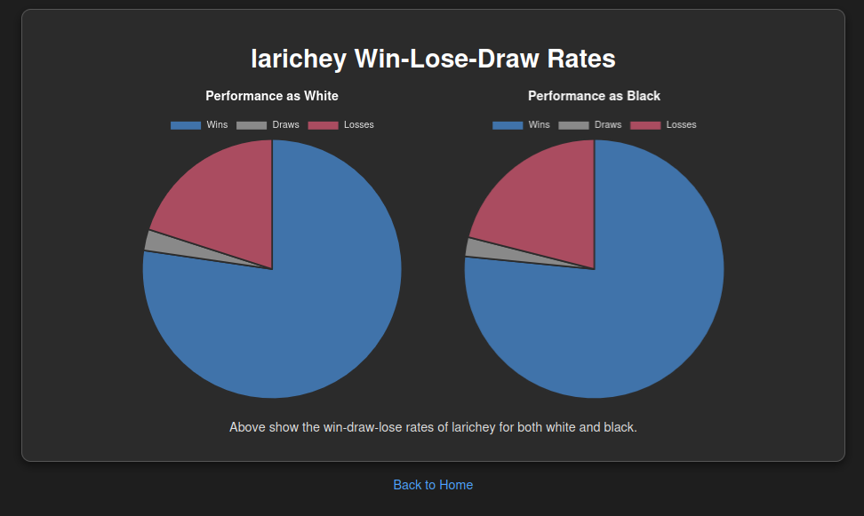
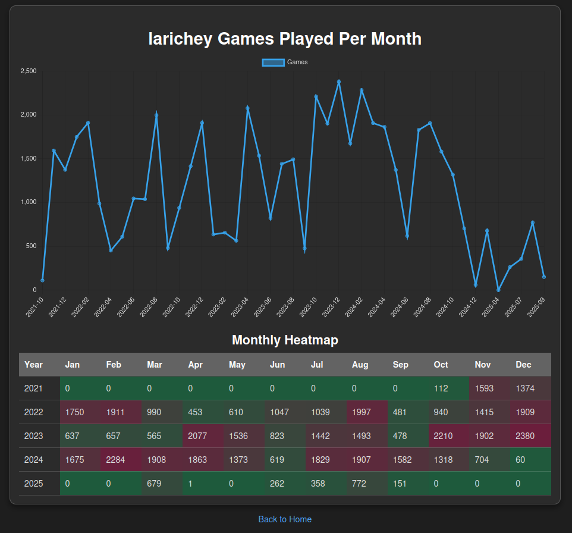
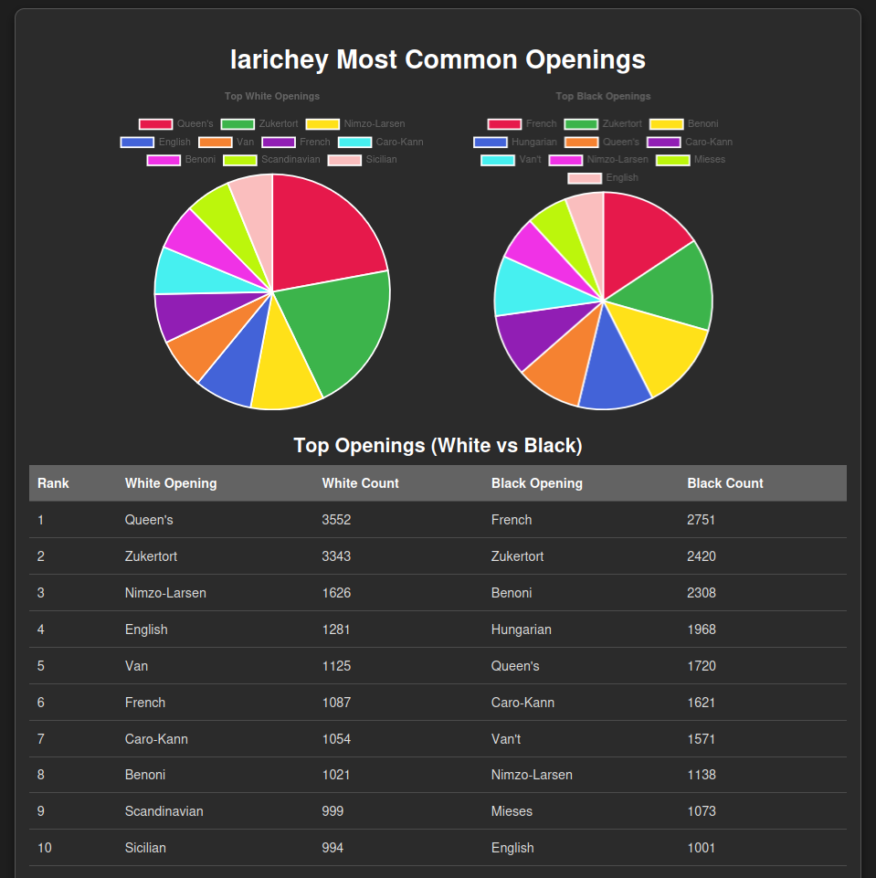
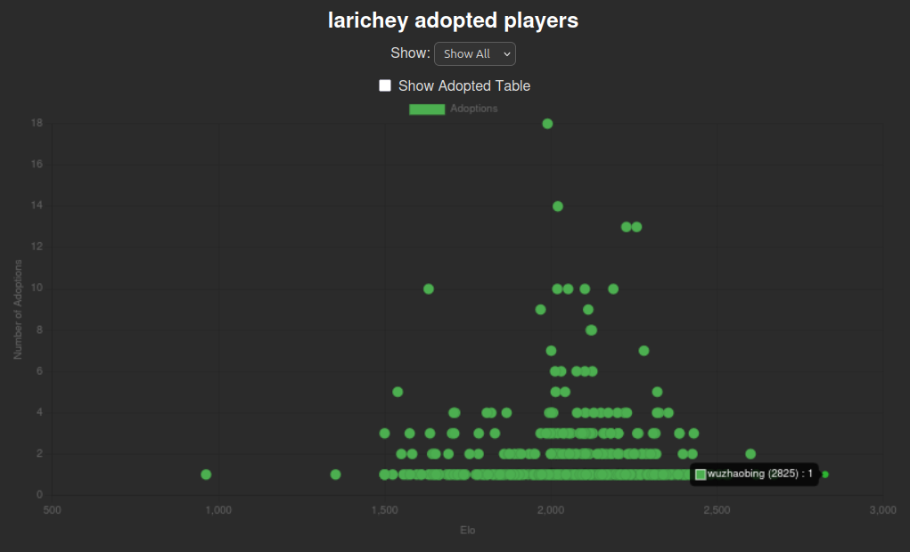
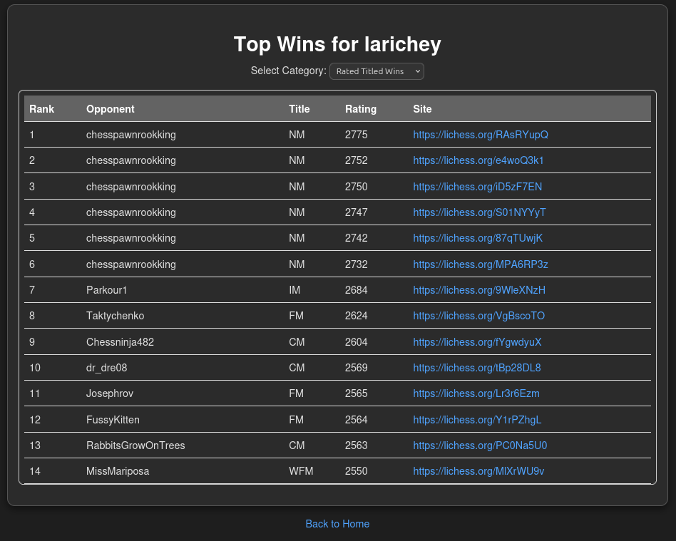
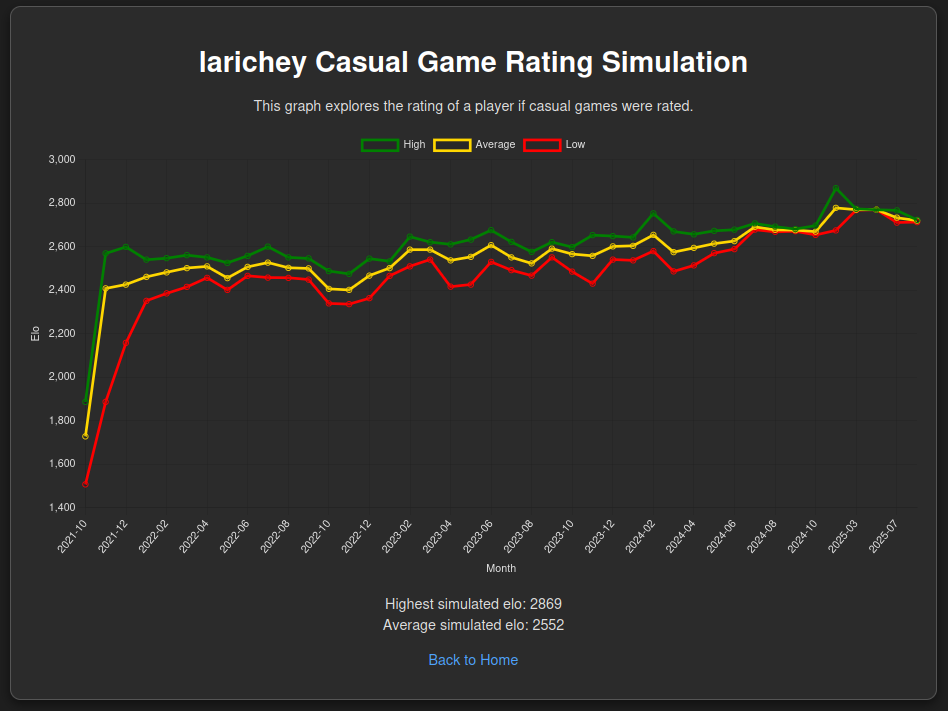

# Chess Analytics Dashboard
A full-stack web application that lets players upload their chess games, analyze trends, and visualize performance over time.  
Built with **Flask + Python (backend), MySQL (database), Gunicorn (server), and Chart.js (frontend)**.  

---

## Features
- **Game Uploads**  
  Upload `.pgn` files directly in the browser for instant analysis.  

- **Interactive Charts (Chart.js)**  
  - **Results Pie Chart** – Win/Loss/Draw percentages as White and Black.  
  - **Games Per Month** – Line chart + data table of play frequency.  
  - **Most Common Openings** – Opening breakdown for White and Black.  
  - **Adoption Data** – Scatter plots and tables showing 10–0 or 0–10 streaks.  
  - **Top Wins** – Highest-rated and most notable victories (rated & unrated).  
  - **Casual Rating Simulation** – Simulated ELO if unrated games were counted (my peak bullet elo: **2650**, simulated peak: **2860** under strict K-factor).  

- **Backend Processing**  
  - Efficient SQL queries for filtering and aggregation.  
  - Modular data pipelines for parsing PGN files.  

- **Frontend UX**  
  - Clean Flask + Jinja templates for navigation.  
  - Responsive chart rendering with Chart.js.  

---

## Tech Stack
- **Backend:** Python, Flask, Gunicorn  
- **Database:** MySQL  
- **Frontend:** HTML, CSS, JavaScript, Jinja, Chart.js  
- **DevOps (Planned):** Docker containerization, setup wizards for DB initialization  

---

## Screenshots







---

## Project Structure
```plaintext
web/
├── app.py
├── db_loader.py
├── elo_calc.py
├── my_dsn.json # your database login creditials
├── run_gunicorn.sh
├── static
│   ├── images
│   │   └── beaker.ico
│   ├── scripts
│   │   ├── adoption_data.js
│   │   ├── casual_rating_simulation.js
│   │   ├── common_charts.js
│   │   ├── games_per_month.js
│   │   ├── most_common_openings.js
│   │   ├── results_pie_chart.js
│   │   └── top_wins.js
│   └── styles
│       ├── adoption_data.css
│       ├── games_per_month.css
│       ├── results_pie_chart.css
│       ├── scroll_container.css
│       ├── theme.css
│       └── top_wins.css
└── templates
    ├── adoption_data.html
    ├── dashboard.html
    ├── games_per_month.html
    ├── index.html
    ├── loading.html
    ├── most_common_openings.html
    ├── rating_simulation.html
    ├── results_pie_chart.html
    └── top_wins.html
```

---

## Getting Started
### Prerequisites
* Python 3.10+
* MySQL installed and running
* Python venv 

### Installation
```bash
# Clone repo
git clone https://github.com/yourusername/chess-dashboard.git
cd chess-dashboard

# Install dependencies
pip install -r requirements.txt

# Set up database
# (Future: automated setup wizard)
```

### Running Locally
```bash
# Start Flask development server
flask run

# Or run with Gunicorn
gunicorn app:app
```

---

## Future Improvements
* Dockerized deployment for “out of the box” setup
* Setup wizard for database installation/creation
* Extended analytics (blunder detection, time management analysis, rating graphs)
* Multi-user authentication for persistent dashboards

---

## Lessons Learned
* Writing complex **SQL queries** for performance analytics
* Integrating **backend (Flask)** with **frontend (Chart.js)**
* Managing **file uploads** and preprocessing large datasets
* Deploying with **Gunicorn** and preparing for containerization (Docker)
* Used Python Multiprocess module to run `db_loader.py` in the background

---

## Contributing
This is a Python + Flask learning project.
Feel free to offer suggestions, fork this repo, and I can review pull requests. 

---

## License
MIT License

